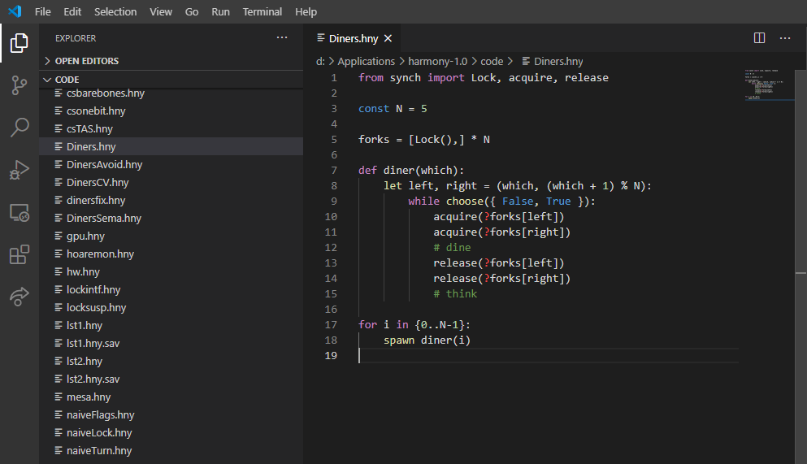
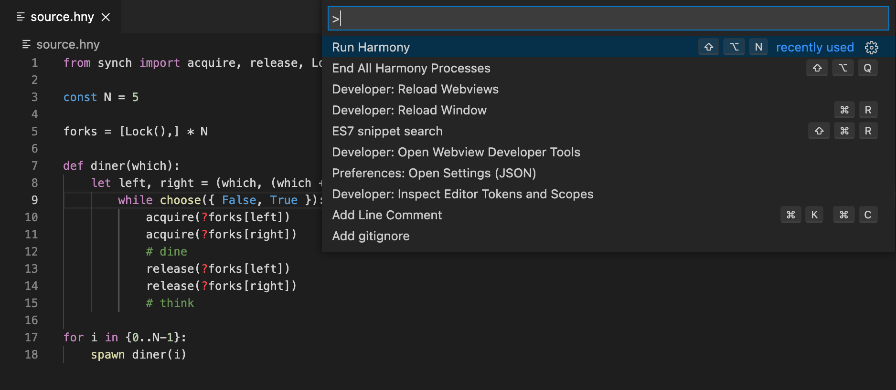
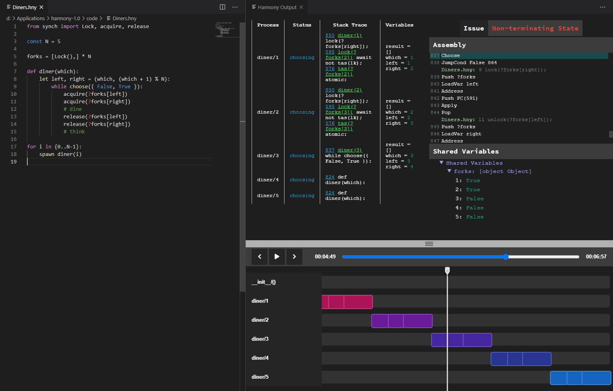

# HarmonyLang Lite

HarmonyLang Lite provides a powerful editing environment for RvR's [Harmony](http://harmony.cs.cornell.edu), a Python-like programming language for testing and experimenting with concurrent and distributed programs. HarmonyLang Lite is built and designed for the GitHub.dev online development environment, allowing users to run Harmony programs on a remote server.

## Features

Provides full syntax highlighting for all flow control, method definition, and literals based on the [default VSCode extension for Python](https://github.com/microsoft/vscode).

Run your Harmony files in VS Code. Press `Alt+Shift+N` to compile and run the current `.hny` file. Alternatively, press `Ctrl+Shift+P` and search `Run Harmony` to find the same command.

See your Harmony Output results, right in VS Code!

> Generated `harmony.html` files are available for download for 5 minutes after analysis.

## Upcoming Features

- Auto-formatter
  - Format on save
  - Format via `Alt+Shift+F`
- Intellisense Support

## Developers

- Kevin Sun`@kevinsun-dev`

- Anthony Yang`@anthonyyangdev`

## Additional Documentation
You can find the Harmony compiler, as well as additional documentation regarding the Harmony language, at our [website](http://harmony.cs.cornell.edu).
Furthermore, you can find more information about the HarmonyLang extension project in [this document](https://docs.google.com/document/d/16pO-tNLfNebIAuqb_vy_z0dJyIFX_Nb-xYDXRfMqOfE/edit?usp=sharing). 

## Release Notes

### 0.1.0
 - Rewrote HarmonyLang for Harmony 1.2, splitting off the Run Harmony (Server) feature into HarmonyLang Lite
 - Rewrote HarmonyLang Lite for complete GitHub.dev compatibility
 - Revamped Model Checker

